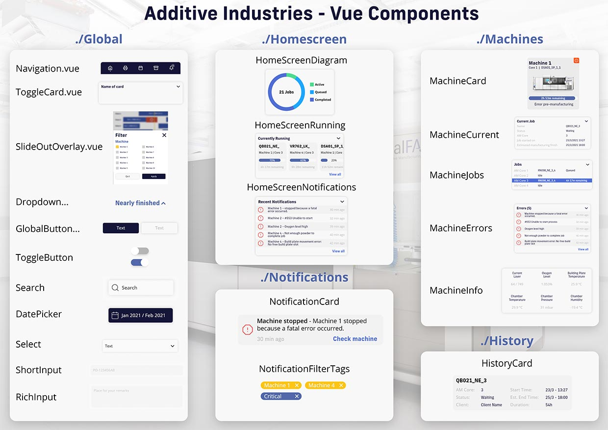

# Additive-vue-app


### Version 1.2.0

Additive-vue-app is an application developed for the company [Additive Industries](https://www.additiveindustries.com/) (Eindhoven, The Netherlands) to remotely monitor the status of their printers.

## Table of Contents
- [Table of Contents](#table-of-contents)
- [Requirements](#requirements)
- [Installation](#installation)
- [Usage](#usage)
    * [Running the application](#running-the-application)
    * [Build for production](#build-for-production)
    * [Add route](#add-route)
    * [Components](#components)
        + [Component overview](#component-overview)
        + [Create component](#create-component)
        + [Add component](#add-component)
- [Developers](#developers)
- [Contributing](#contributing)
- [License](#license)

## Requirements
* [NodeJs](https://nodejs.org/en/) - v14.15.5

## Installation

Clone this repository from the command line, or download it as a `.zip`

```
git clone https://github.com/RobinGalema/Additive-Vue-App.git
```

Open the project folder with the following command
```
cd Additive-Vue-App
```

Install npm
```
npm install
```

Install router package
```
npm install vue-router@next
```

## Usage
### Running the application
Once you run this command, the application will be available at `localhost:8080`
```
npm run serve
```

### Build for production
Compiling and minifying all files for production. This command outputs your application to a new folder in the root of the project called `dist`.
**Note: If you run this command all content in the dist folder will be overwritten**

```
npm run build
```

### Add route
To add a router view go to `src/router/index.js`. At the top of the file add a new rule that imports your view

```javascript
import [NAME OF VIEW] from '../views/[NAME OF VIEW]'
```

In the array called `routes`, add a new item like:
```javascript
{
    path: '[URL OF CHOICE]',
        name: '[NAME]',
        component: [NAME OF THE VIEW COMPONENT]
}
```

### Components
#### Component overview
Below you can find an overview of all (current) components in the application with their corresponding names. All component-files can be found in the folder `src/components`.



#### Create component
Go to the folder `src/compontents`. If the component you are making will be a global component that can be used everywhere place it in the subfolder `Global`. Else go to or create a folder with the name of the page you want to make the component for. Once you are in the right folder create a new file called `[NAME OF YOUR COMPONENT].vue`, and add the following content:
```vue
<template>
  Hi, i am a Vue component :D
</template>

<script>
export default {
  name: '[NAME OF YOUR COMPONENT]'
}
</script>
```
Everything inside the `<template>` tag will be outputted as a component. If you want to add styling to your component you can do that by adding a `<style>` at the bottom of your component file, outside the `<template>` element. The styling you add here will affect all elements within the application. If you want the styling to be specific for this component, you can add the word "scoped" to the `<style>` tag. Like:
```html
<style scoped>
    /* your styling here */
</style>
```

#### Add component
To add a component go to a specific view or to the `App.vue` file in the root of the `src` folder. The first thing you need to do to add your component is importing it into the file, so Vue can access it. You can do this by adding the following line to the top of your `<script>` element.
```html
import [NAME_OF_YOUR_COMPONENT] from "@/components/[PATH_TO_YOUR_COMPONENT]";
```
Once you've imported the component you can define it in the export default. You can do this by adding a new item called `components`. In this item you can list all of your components you want to use in this view. Once you've done that, your `export default` should look similar to the example below.
```javascript
export default {
    name: 'App',
    components: {
        [NAME_OF_YOUR_COMPONENT],
    }
}
```
The next step is to use the component in your page. You can do this by adding a new element with the name of your component to your `<template>` element. It should look similar to:

```html
<template>
    <NAME_OF_YOUR_COMPONENT />
</template>
```

## Developers
* **Robin Galema** - [robingalema.nl](https://www.robingalema.nl/)
* **Nick Graus**
* **Noah van Schijndel** - [noahvanschijndel.nl](http://noahvanschijndel.nl/)
* **Niek van de Vondervoort** - [niekvandevondervoort.com](https://niekvandevondervoort.com)
* **Büşra Yaydemir**

## Contributing
Pull requests are welcome. For major changes, please open an issue first to discuss what you would like to change.

## License
This project is licensed under the [MIT License](https://choosealicense.com/licenses/mit/)